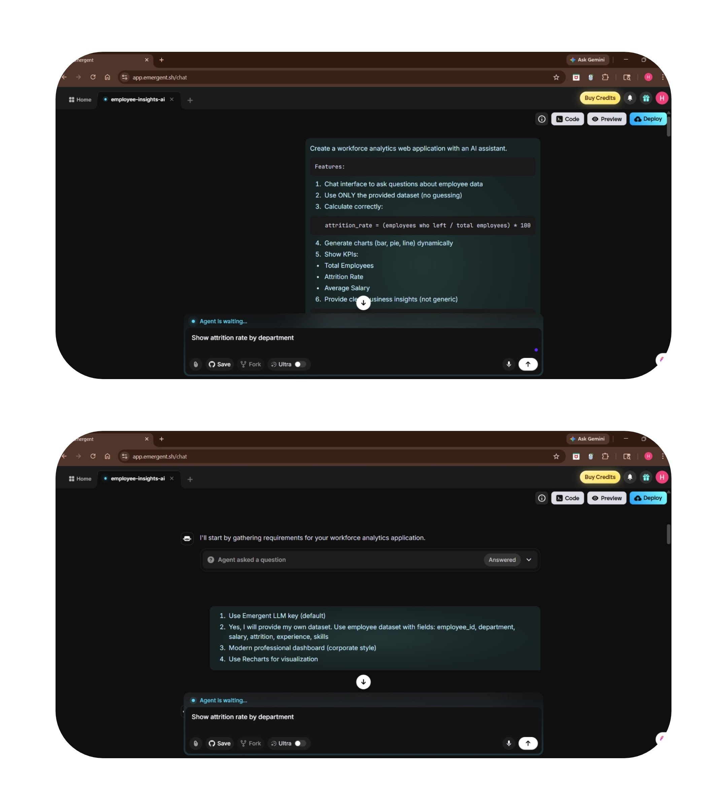

# 🚀 Workforce Analytics AI Dashboard

## 📌 Overview
An AI-powered Workforce Analytics Dashboard that enables users to upload employee datasets and analyze them using natural language queries.

The system leverages **prompt engineering and LLMs** to ensure accurate KPI calculations, structured insights, and dynamic visualization generation. Prompt constraints are implemented to eliminate hallucinations and ensure strictly data-driven responses.

---

## 🚀 Key Features
- Upload employee dataset (CSV format)
- AI Assistant for natural language-based data queries
- Accurate KPI calculations (Attrition Rate, Total Employees, Average Salary)
- Dynamic chart generation (bar, pie, line)
- Real-time business insights from structured data
- Prompt-controlled logic to prevent incorrect outputs

---

## 🛠️ Tools & Technologies
- Emergent AI (AI App Builder)
- Prompt Engineering (LLM-based control)
- ChatGPT (LLM)
- Recharts (Data Visualization)

---

## 🖥️ Dashboard UI

📌 **Description:**
- Complete interface combining AI assistant, KPI cards, charts, and upload system
- Designed for interactive workforce analytics

---
## Prompt Engineering:

## 📂 Data Upload – CSV Input Interface

📌 **Features:**
- Upload employee dataset (CSV format)
- Drag & Drop support
- Used as input for AI-based analytics

---

## 🤖 AI Assistant – Query & Response Interface

📌 **Features:**
- Ask questions like:
  - “Show attrition rate by department”
  - “Which department has highest attrition?”
- Generates:
  - KPI insights
  - Business analysis
  - Visual outputs

---

## 📌 KPI Cards – Key Metrics Overview

📌 **Metrics Displayed:**
- Total Employees → 200  
- Attrition Rate → 18.5%  
- Average Salary → $68,450  

---

## 📊 Chart Output – Attrition Analysis

📌 **Description:**
- Dynamic bar chart showing attrition rate by department
- Identifies high and low attrition areas

---

## 🧠 Prompt Engineering (Core Logic)

### System-Level Prompt
Create a workforce analytics web application with an AI assistant.

Features:
1. Chat interface to ask questions about employee data  
2. Use ONLY the provided dataset (no guessing)  
3. Calculate correctly:  
   attrition_rate = (employees who left / total employees) * 100  
4. Generate charts (bar, pie, line) dynamically  
5. Show KPIs:  
   - Total Employees  
   - Attrition Rate  
   - Average Salary  
6. Provide clear business insights based strictly on data  

---

### Key Constraints
- Use ONLY the uploaded dataset (no guessing)
- attrition_rate = (employees who left / total employees) * 100

---

## 💡 Sample Queries
- Show attrition rate by department  
- Which department has highest attrition?  
- Show average salary by department  

---

## 📊 Output Highlights
- AI-generated KPI metrics  
- Department-level insights  
- Dynamic visualizations based on queries  

---

## 🎯 Key Learnings
- Applied prompt engineering to control AI behavior and improve accuracy  
- Implemented strict constraints to eliminate hallucinations  
- Combined AI interaction with data analytics concepts  
- Built an end-to-end AI-powered analytics workflow  

---

## 🔗 LinkedIn Post: https://www.linkedin.com/posts/himanshu-anand-684656253_dataanalytics-promptengineering-aiprojects-ugcPost-7448379335301914625-hzI6?utm_source=share&utm_medium=member_android&rcm=ACoAAD6Q-UQBpuWrd6zWv5z_jtsY6pXSa8ZzC5Q

---

## 👨‍💻 Author
**Himanshu Anand**
