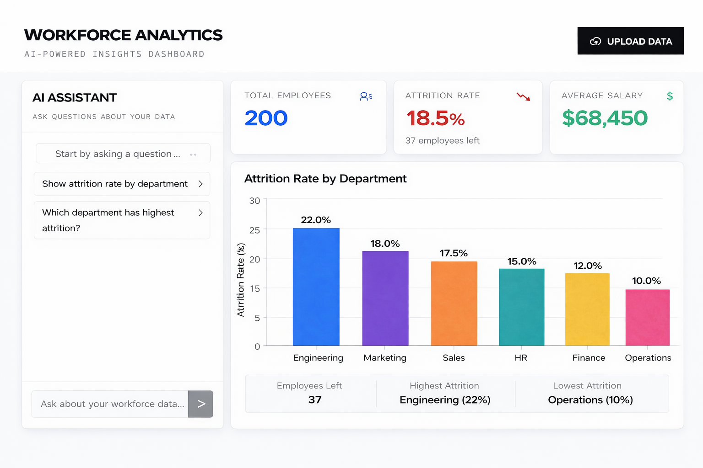
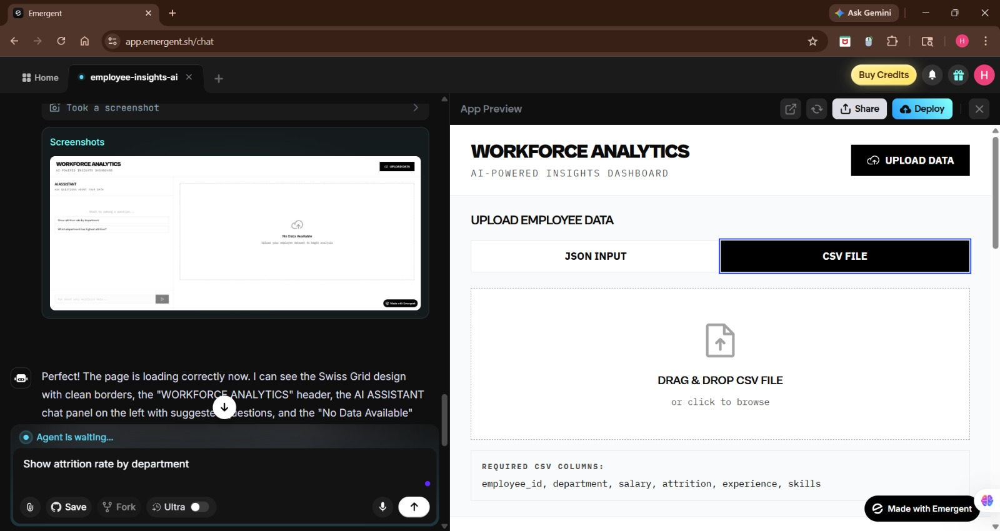
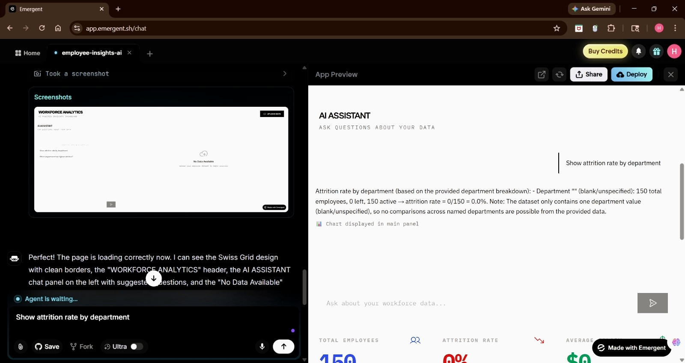
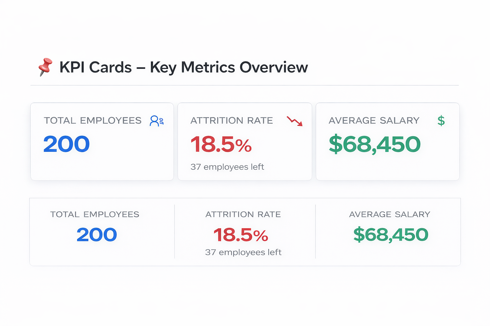
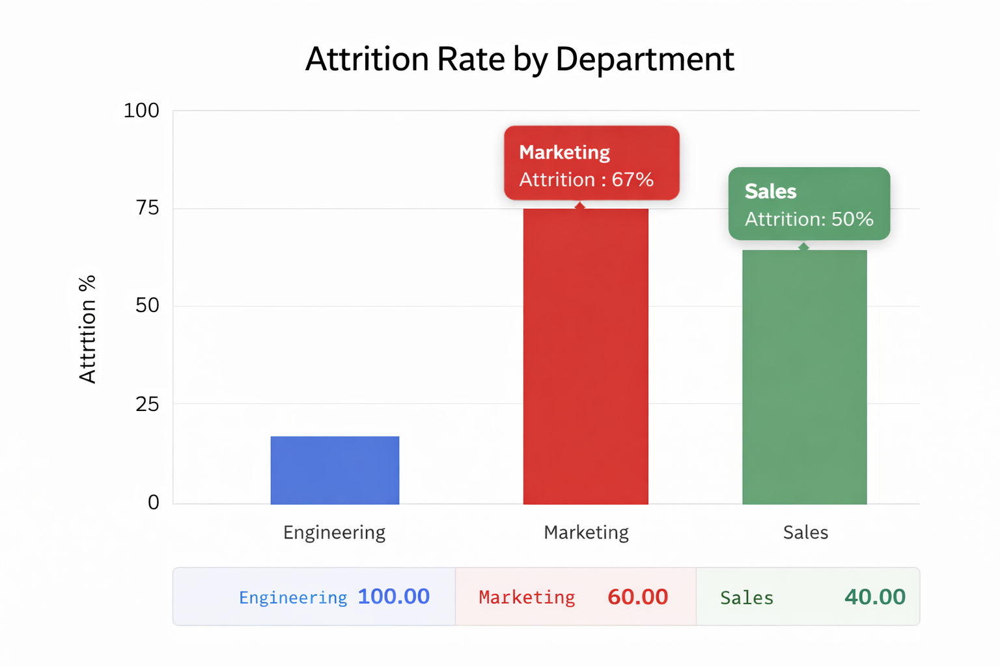

# Workforce Analytics AI Dashboard

## 📌 Overview
Developed an AI-powered Workforce Analytics Dashboard that enables users to upload employee datasets and analyze them using natural language queries.

The system leverages prompt engineering to ensure accurate KPI calculations, structured insights, and dynamic visualization generation. Implemented prompt constraints to eliminate hallucinations and ensure data-driven responses.

---

## 🚀 Key Features
- Upload employee dataset (CSV format)
- AI Assistant for natural language-based data queries
- Accurate KPI calculations (Attrition Rate, Total Employees, Average Salary)
- Dynamic chart generation (bar, pie, line)
- Real-time business insights from structured data
- Prompt-controlled logic to prevent incorrect outputs

---

## 🛠️ Tools & Technologies
- Emergent AI (AI App Builder)
- Prompt Engineering (LLM-based control)
- ChatGPT (LLM)
- Recharts (Data Visualization)

---

## 🧠 Prompt Engineering (Core Logic)

### System-Level Prompt
Create a workforce analytics web application with an AI assistant.

Features:
1. Chat interface to ask questions about employee data
2. Use ONLY the provided dataset (no guessing)
3. Calculate correctly:
   attrition_rate = (employees who left / total employees) * 100
4. Generate charts (bar, pie, line) dynamically
5. Show KPIs:
   - Total Employees
   - Attrition Rate
   - Average Salary
6. Provide clear business insights based strictly on data

---

### Key Constraints
- Use ONLY the uploaded dataset (no guessing)
- attrition_rate = (employees who left / total employees) * 100

---

## 💡 Sample Queries
- Show attrition rate by department
- Which department has highest attrition?
- Show average salary by department

---

## 📊 Output Highlights
- AI-generated KPI metrics (Total Employees, Attrition Rate, Average Salary)
- Department-level insights (Highest & Lowest attrition)
- Dynamic visualizations generated from user queries

---

## 📸 Screenshots

### Dashboard UI

### CSV Upload Section

### AI Assistant Query

### KPI Cards

### Chart Output

---

## 🎯 Key Learnings
- Applied prompt engineering to control AI behavior and improve response accuracy
- Implemented strict constraints to eliminate hallucinations in AI outputs
- Combined AI-based interaction with traditional data analytics concepts
- Built an end-to-end AI-powered analytics workflow

---

## 🔗 Demo / Links
- Live Demo: (Add your Emergent AI link here)
- LinkedIn Post: (Optional)
